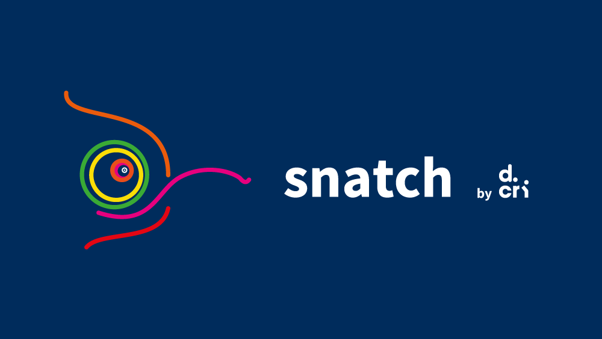
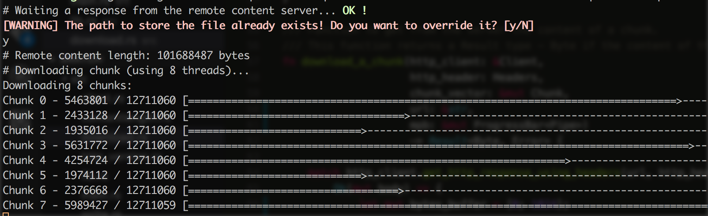

# snatch
A simple, fast and interruptable download accelerator, written in Rust



(A special thanks to [@frankirito](https://github.com/frankirito) for this awesome logo !)

## Current features

* **Simple**: a command line to manage easily your downloads ;
* **Fast**: multithreading support.

**NOTE**: _Snatch_ is on _alpha_ version. This version runs well on remote contents that length is known **before** the download (by the `content-length` header from the server response) - also, the _Interruptable_ feature is not implemented yet.

## Installation

1. Please to install Rust and Cargo using [rustup](https://www.rustup.rs/) ;
2. Install _Snatch_: `cargo install --git https://github.com/derniercri/snatch.git` ;
3. Enjoy !

## Usage

```
Usage:
    snatch [OPTIONS]

Snatch, a simple, fast and interruptable download accelerator, written in Rust.

optional arguments:
  -h,--help             show this help message and exit
  -f,--file FILE        The local file to save the remote content file
  -t,--threads THREADS  Number of threads available to download
  -u,--url URL          Remote content URL to download
  -v,--verbose          Verbose mode
```

## Screenshot
 


## File examples

* [A simple PDF file](http://www.cbu.edu.zm/downloads/pdf-sample.pdf)
* [Big Buck Bunny](http://distribution.bbb3d.renderfarming.net/video/mp4/bbb_sunflower_1080p_60fps_stereo_abl.mp4), a big free mp4 file
* [The cat DNA](http://hgdownload.cse.ucsc.edu/goldenPath/felCat8/bigZips/felCat8.fa.gz), a big .gz file
* [A big PDF file from Princeton](http://scholar.princeton.edu/sites/default/files/oversize_pdf_test_0.pdf)

## Contributing

You want to contribute to _Snatch_ ?  
This is a list of ways you can help us out :

* improve the documentation,
* improve the CLI,
* add new features (please to see our issues),
* report bugs.

If you want to create a pull request, this is the procedure to make it great:

* create an issue to explain the problem you encountered (except for typo),
* fork the project,
* create a local branch to make changes (from our `devel` branch),
* test your changes,
* create a pull request (please to compare with our `devel` branch),
* explain your changes,
* submit !

Thank you for your interest in contributing to _Snatch_ ! :-D 

## Build issues

* `fatal error: 'openssl/hmac.h' file not found`  
If you are on a GNU/Linux distribution (like Ubuntu), please install `libssl-dev`.  
If you are on macOS, please install `openssl` and check your OpenSSL configuration:  

```
brew install openssl
export OPENSSL_INCLUDE_DIR=`brew --prefix openssl`/include
export OPENSSL_LIB_DIR=`brew --prefix openssl`/lib
export DEP_OPENSSL_INCLUDE=`brew --prefix openssl`/include
```
